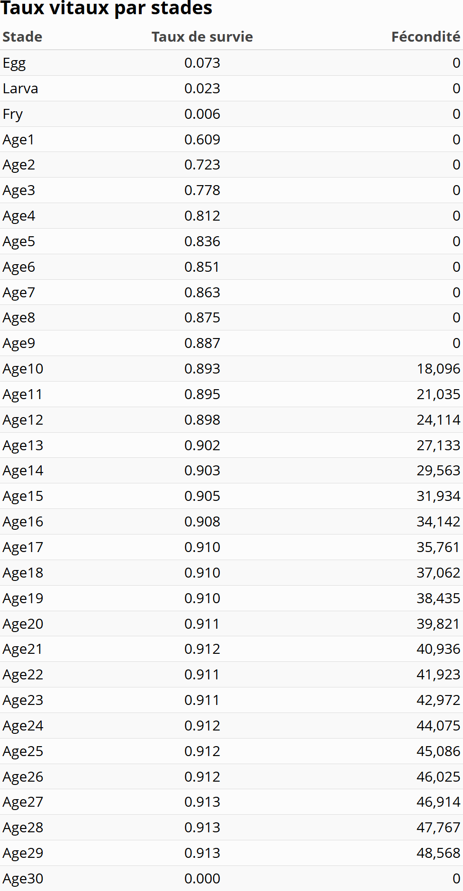

Le Chevalier cuivré (*Moxostoma hubbsi*) est une espèce de poisson d'eau douce endémique du Québec, au Canada. Sa distribution étant restreinte à certains secteurs du fleuve Saint-Laurent et de la rivière Richelieu, sa population est désignée comme en voie de disparition. La dégradation et la perte d'habitat en sont les causes principales [@cosepac_evaluation_2014]. À ce jour, seules deux frayères sont connues, et peu de mesures concrètes sont mises en place pour assurer leur préservation à perpétuité [@cosepac_evaluation_2014]. 
  
Actuellement, des ensemencements sont effectués chaque année afin de maintenir une population viable. Plus de 14 000 larves et 230 000 alevins sont ainsi ensemencés dans la rivière Richelieu pour pallier le taux de recrutement très faible [@cosepac_evaluation_2014]. L'une des principales difficultés liées à la conservation de cette espèce réside dans le manque de connaissances biologiques sur ses traits d'histoire de vie. Une étude a récemment été réalisée pour estimer la viabilité à long terme de la population selon trois scénarios distincts reflétant la situation actuelle de l'espèce [@bannester-marchand_population_2025]. Cette recherche a utilisé un modèle de matrice de Leslie à 33 stades pour réaliser une analyse de viabilité de population (PVA) et évaluer l'effet des ensemencements à long terme sur la population. L'objectif de la présente étude est de reproduire ces analyses en développant un modèle simplifié basé sur une matrice de Lefkovitch à 3 stades seulement.  

Méthodologie {.unnumbered}
========================================

### Données {.unnumbered}

Les données utilisées pour les analyses ont directement été tirées de l'article de @bannester-marchand_population_2025, laquelle synthétise les paramètres biologiques issus de plusieurs études antérieures [@vachon_recherche_2020; @vachon_reproduction_2021-1; @vachon_reproduction_2021-2; @mongeau_biologie_1992; @dahlberg_review_1979; @mongeau_biologie_1986]. Ces données sont structurées sous forme de matrices de Leslie à 33 stades, où la sous-diagonale représente les taux de survie inter-stades et la première rangée exprime la fécondité. À titre d'exemple, les paramètres du scénario « mesuré » sont illustrés à la Figure 1. Afin de couvrir l'ensemble des incertitudes biologiques, les deux autres matrices de @bannester-marchand_population_2025 (scénarios «nul» et «menacé») ont également été intégrées aux présentes analyses pour permettre une comparaison exhaustive des modèles simplifiés.

{ width=50% }

 

### Agrégation {.unnumbered}

Pour réduire la complexité du modèle vers une matrice de Lefkovitch à trois stades, les stades intra-annuels de la matrice originale (« eggs », « larvae » et « fry ») ont été combinés en un premier stade nommé « Juvéniles ». Les stades 4 à 13, correspondant aux individus adultes non reproducteurs, ont été agrégés pour former le stade « Pré-adultes ». Enfin, les stades 14 à 33, regroupant les individus matures, forment le stade « Adultes ».

Afin de préserver les dynamiques d'élasticité du modèle original, nous avons appliqué la méthode d'agrégation décrite par @hinrichsen_theory_2026. La dynamique initiale est formulée sous forme matricielle :

$$
x(t+1) = Ax(t)
$$

où $x(t)$ est la distribution des individus par classe d'âge au temps $t$ et $A$ est la matrice de Leslie ($n \times n$). La projection vers la structure agrégée $y(t)$ repose sur une matrice de partition $P$ ($m \times n$) :

$$
y(t) = Px(t)
$$
La matrice agrégée $\hat{B}$ ($m \times m$) est ensuite construite selon :

$$
\hat{B} = PA^kQ
$$

où $k$  représente le temps de résidence dans le stade et $Q$ est une matrice de poids d'agrégation définie par :

$$
Q = WP^\top(PWP^\top)^{-1}
$$
où $W = \text{diag}(w)$ correspond à la distribution stable des âges (vecteur propre dominant de $A$). Cette approche permet de conserver le taux de croissance asymptotique $\lambda$ ainsi que les propriétés de sensibilité du modèle initial [@hinrichsen_aggregation_2023].

### Stochasticité et Variabilité {.unnumbered}

Dans l'étude de @bannester-marchand_population_2025, la fécondité comporte une part de variabilité stochastique. Cette stochasticité a été ajoutée en supposant que la fécondité annuelle des individus variait selon une loi normale ayant une moyenne ($\mu$) de 0 et un écart-type ($\sigma$) de 0,25. Ainsi, la fécondité des individus varie entre aucun œuf par année jusqu'au double de la moyenne annuelle. Contrairement à l'approche de @bannester-marchand_population_2025, où chaque classe d'âge possédait une variabilité indépendante, la présente étude applique une variabilité annuelle synchrone à l'ensemble du stade « Adultes ». Cette décision repose sur une logique biologique : les individus reproducteurs d'une même population sont soumis aux mêmes fluctuations environnementales. Étant donné que l'espèce est restreinte à une aire de répartition limitée et à seulement deux sites de fraie connus, il est plus réaliste de modéliser une réponse commune de la fécondité face aux conditions annuelles.

Pour les taux de survie, nous avons suivi la méthode de @bannester-marchand_population_2025 en utilisant une distribution bêta. Le paramètre $\alpha$ est défini comme suit :
$$
\frac{s_{stade} \times \beta}{1 - s_{stade}}
$$
où $s_{stade}$ est la survie du stade et $\beta$ représente la variabilité. Nous avons sélectionné les valeurs de @bannester-marchand_population_2025 offrant la plus grande variabilité, soit $\beta = 5,05$ pour les Juvéniles et $\beta = 0,75$ pour les Pré-adultes. Pour les probabilités de rester dans un stade, les valeurs de $\beta$ ont été ajustées (1 et 0,75) afin d'assurer que la somme de la survie et de la stase demeure biologiquement cohérente (inférieure ou égale à 1).

### Modélisation {.unnumbered}
Le modèle de viabilité des populations (PVA) a été simulé sur $N = 5000$ itérations pour une période de $t = 100$ ans. La probabilité d'extinction est définie par l'atteinte d'une abondance nulle :

$$
P_{ext} = P(\exists t \in [0, 100] : n_{total}(t) = 0)
$$
Nous avons également évalué la probabilité que l'abondance des individus matures ($n_{mat}$) se maintienne au-dessus de seuils critiques $k$ (0 et 1000 individus) pour favoriser la diversité génétique :

$$
P(n_{mat}(t) > k), \quad \forall t \in [0, 100] \text{ où } k \in \{0, 1000\}
$$
Enfin, nous avons testé l'efficacité des ensemencements pour atteindre une cible de 5000 individus matures. Bien que l'analyse utilise la matrice agrégée à trois stades, les taux de survie spécifiques aux stades ensemencés (larves, alevins, individus d'un an et de dix ans) ont été maintenus identiques à ceux de @bannester-marchand_population_2025 pour garantir la comparabilité des stratégies d'intervention.

Résultats {.unnumbered}
========================

{ width=80% height=80% }

 

Les simulations stochastiques indiquent un déclin démographique dans l'ensemble des scénarios testés. Le scénario « mesuré » (c) montre l'effondrement le plus rapide, avec une abondance d'individus matures devenant résiduelle après seulement quelques décennies. Bien que les scénarios « menacé » (b) et « nul » (a) ralentissent la vitesse de déclin, la tendance à la baisse demeure constante au fil du temps. Une forte variabilité inter-simulations est observée, comme en témoignent les larges intervalles de confiance, soulignant l'impact prépondérant de la stochasticité sur la dynamique de l'espèce, bien que celle-ci soit plus faible que celle observée dans @bannester-marchand_population_2025. Malgré cette incertitude, les médianes convergent vers une conclusion identique : la population ne parvient pas à se maintenir à long terme. On observe que les différences entre scénarios changent surtout la vitesse du déclin, mais pas la tendance générale, ce qui suggère que les paramètres de survie et la structure du modèle contrôlent fortement la dynamique.

{ width=80% height=80% }

 

Les probabilités de passer sous des seuils critiques augmentent rapidement (Figure 2). La probabilité que la population mature chute sous la barre des 1000 individus devient élevée dans tous les scénarios, y compris pour le scénario « nul ». Ainsi, même sous les hypothèses les plus optimistes, le maintien d'une population viable à long terme apparaît peu probable sans intervention majeure.
 

{ width=80% height=80% }

 

Les simulations d'ensemencement révèlent que des apports massifs sont nécessaires pour atteindre une cible de 5000 individus matures après un siècle.Si l'augmentation du nombre d'individus introduits accroît l'abondance finale, cette relation n'est pas proportionnelle. Notamment, les ensemencements réalisés à des stades de vie plus avancés (individus d'un an ou matures) présentent une efficacité nettement supérieure à ceux effectués aux stades larvaires ou d'alevins (Figure 3).

Discussion {.unnumbered}
========================

Nos résultats diffèrent de ceux obtenus par @bannester-marchand_population_2025. Dans tous les scénarios testés, les populations simulées avec la matrice de Lefkovitch à trois stades tendent à s’effondrer plus rapidement. De plus, même une augmentation massive des ensemencements ne parvient pas à maintenir une abondance élevée d'individus matures à long terme. Ces observations suggèrent que notre modèle simplifié offre une vision plus pessimiste de la dynamique de la population.

Cette divergence s’explique probablement par la simplification structurelle du modèle. Le passage de 33 stades à seulement trois entraîne une perte substantielle d'information sur les transitions entre les classes d'âge. Bien que la méthode d’agrégation utilisée permette de conserver certaines propriétés asymptotiques, comme le taux de croissance ($\lambda$), elle ne capture pas nécessairement les dynamiques transitoires à court et moyen terme. Or, ces dynamiques sont cruciales dans une analyse de viabilité des populations (PVA), particulièrement lorsque l'effectif est faible et sensible aux fluctuations.

Le traitement de la stochasticité peut aussi expliquer les différences observées. Dans notre modèle, la fécondité varie de façon synchrone pour l'ensemble des adultes, alors que @bannester-marchand_population_2025 appliquaient une variabilité indépendante entre les classes d’âge. Ce choix amplifie les fluctuations annuelles : concrètement, une année environnementale défavorable affecte simultanément tous les reproducteurs, ce qui peut accélérer le déclin démographique. À cet égard, il serait pertinent de tester différentes approches de modélisation de la stochasticité. L'absence de consensus dans la littérature sur la méthode optimale pour combiner les variabilités inter-stades lors d'une agrégation constitue une limite ici explorée ; une paramétrisation plus fine, appuyée par une expertise accrue en dynamique stochastique, permettrait potentiellement de converger davantage vers les résultats du modèle détaillé.

Les résultats obtenus montrent également que l’ensemencement, tel qu’il est modélisé ici, ne suffit pas à assurer la viabilité de la population. L'augmentation du nombre de larves ou d'alevins n'a pas l'impact escompté sur l'abondance des adultes à long terme. Cela souligne le rôle critique des stades juvéniles et pré-adultes : si la survie à ces étapes de vie est trop faible, le recrutement vers le stade adulte demeure insuffisant, quel que soit l'effort d'introduction initial. Par conséquent, des mesures visant à améliorer les conditions de survie (restauration de l'habitat, qualité de l'eau, accès aux frayères) pourraient s'avérer plus efficaces qu'une simple intensification des ensemencements.

Malgré ces différences, les tendances générales demeurent cohérentes avec les connaissances actuelles sur l’espèce. La population reste extrêmement vulnérable et dépendante des interventions humaines. La difficulté à maintenir une population stable sans soutien artificiel confirme le statut précaire du Chevalier cuivré.

En conclusion, cette étude met en évidence les limites inhérentes aux modèles simplifiés. Si la matrice de Lefkovitch à trois stades est plus parcimonieuse et exige moins de données, elle introduit des biais importants qui, dans ce cas précis, semblent accentuer le déclin de la population. Bien que ce type de modèle soit utile pour explorer rapidement divers scénarios, il doit être utilisé avec prudence. Pour des analyses de viabilité plus précises, le maintien d'une structure d'âge détaillée demeure essentiel.

Bibliographie {.unnumbered}
========================

